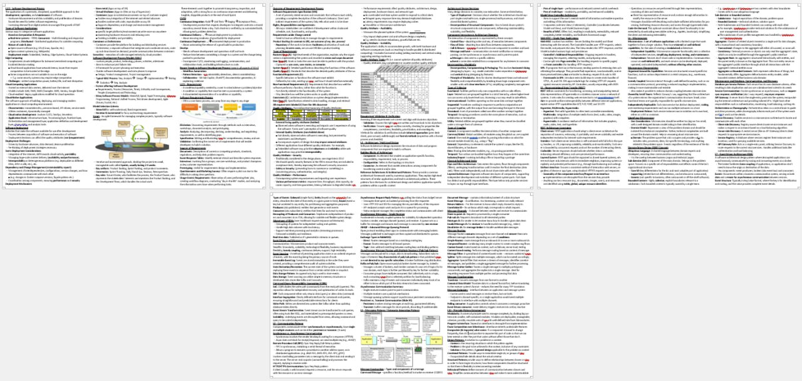
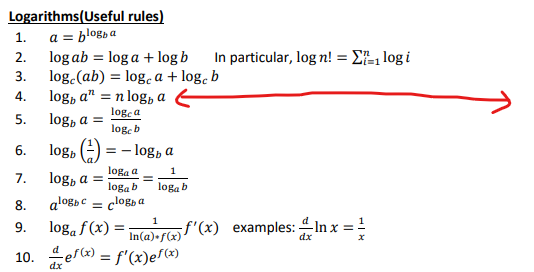
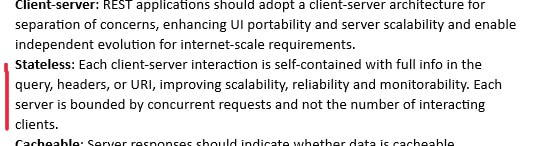
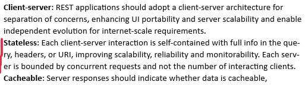
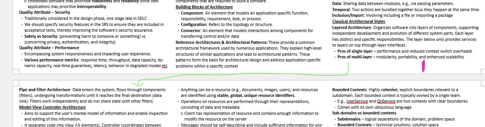
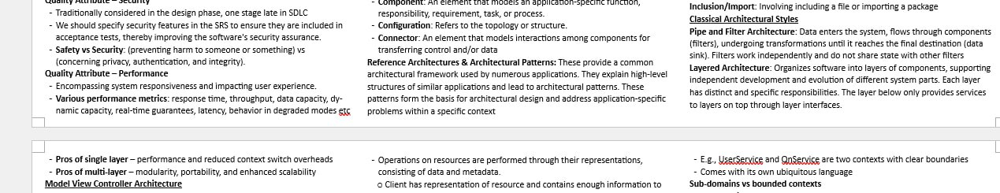

# NUS CS Cheatsheets
*By Wong Chee Hong (2020 - 2024)*

These are some cheatsheets I made for myself during my undergrad career at NUS. These notes may serve useful when you are in a pinch and need a cheatsheet before your exams, but my advice is to use these cheatsheets as a reference, and make your own cheatsheet. 

Making your own cheatsheet is way more beneficial than using someone else's, for the following reason:
- Using someone else's cheatsheet means you need to scan through the entire cheatsheet to find a piece of knowledge - `O(n)` time lookup
- If you made your own cheatsheet, chances are you know where a piece of knowledge is - `O(1)` time lookup

## Process of making cheatsheets
So, the reason why i am sharing these because I think some of them are too good to not share. Making cheatsheets is one of the skills i have honed over the years, with my first cheatsheet for FIN2704X. If you don't believe me, look at this cheatsheet I made for CS3219.

> 
>
> *CS3219 cheatsheet - My magnum opus*

1. **Start early**: I usually start making my cheatsheets a week before the exam. This is because I want to have time to digest the content and make the cheatsheet as concise as possible. It is also possible to make them 3 days before the exam, like what I have done with CS3219, though I don't recommend it.

2. **Follow some format**: For me, my cheatsheet are organized by lectures. I tend to recall information by remembering where I learned them, so organizing them by lectures is the most intuitive way for me. The process of making the cheatsheet serves to reinforce where I could have encountered a certain piece of knowledge, effectively enabling O(1) lookup.

3. **Use ChatGPT**: Nowadays, ChatGPT is very useful in generating paragraphs of text and as reference for what to include in the cheatsheet. Only the FIN2704X cheatsheet was written before the ChatGPT era, using my friend's cheatsheet as a reference. The others, were made by dumping the lecture slides into chatgpt, and asking it to summarize it while I pick through it bit by bit to make the cheatsheet.

4. **Learn Latex**: You don't need to use LaTex to make your entire cheatsheet, in fact it may be more trouble than it is worth. **However, did you know we can typeset formulas in MSWord with LaTex?** LaTex is very useful for typesetting formulas, like those in my FIN2704X cheathseet, so it is good to know how to type commonly used symbols like `\frac{}{}`, `\summation`, `\infty` (for infinity), and greek letters like `\alpha`, `\beta`, `\rho`, `\phi` etc. 

5. **Tricks to maximizing your single A4 cheatsheet**: Sometimes, we are allowed to bring in a single A4 cheatsheet into the exam halls. In order to cram as many lines as possible, there are some tricks I use:

    - **2 Page per side**: I usually print my cheatsheet double sided, with 2 pages per side. This allows me to have 4 pages of cheatsheet in a single A4 paper.
  
    - **2-3 column format**: Use 2 or 3 columns to maximize the space. Sometimes, we have certain sections that are quite short, like definitions and formulas. 
        > 
        >
        > *Imagine your cheatsheet is the width of your entire A4 paper, then short lines like these means more wasted space!*

    - **Use font-size 6**: Or font-size 8 if you are printing 2 pages per side. Fun fact: SoC printers have amazing print quality, much better than those cardplex printers at CLB and outside Biz.
 
    - **Turn 2 lines into 1**: Sometimes, it is possible to reduce the number of lines with some nifty tricks. In typesetting, these are [known as widows/orphans/runts](https://en.wikipedia.org/wiki/Widows_and_orphans). Let me show you 2 examples:
  
        >  
        >
        > Here, we have a word that flows into the next line. We are wasting precious space using a line to contain a single word when we could have used it to fit an entire sentence. In order to fit the word into the previous line, I applied **hyphenation** selectively in the paragraph. I dont apply hyphenation everywhere since that reduces readability, but over here, it is an acceptable trade-off

        > 
        >
        > Here, I have a column that flows into the next column as shown, but there are 2 lines of white space that cannot fit the 3 line paragraph in the next column.
        >
        > 
        >
        > By simply re-ordering my points, i made full use of that 2-line white space that was not utilised before.

